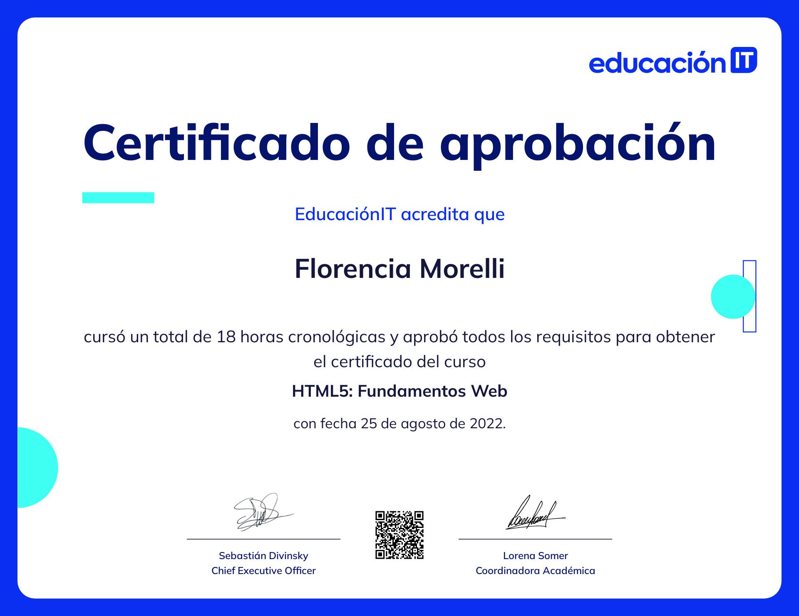

# WWWapas

This repository contains "WWWapas," which was developed as the final integrative project for the HTML5 and CSS3 course I completed at [Educación IT](https://www.educacionit.com/).

## Project Overview

The objective of this project was to apply the skills and knowledge acquired during the course to create a fully functional website using HTML5 and CSS3. The project demonstrates my proficiency in:

- Structuring web content with semantic HTML5 elements
- Styling web pages with CSS3
- Implementing responsive design principles
- Enhancing user experience with interactive elements

## Features

- **Responsive Design:** Ensures the website is accessible and visually appealing across various devices and screen sizes.
- **Semantic HTML:** Utilizes modern HTML5 elements to improve the structure and accessibility of the content.
- **CSS3 Styling:** Includes advanced CSS techniques to create an engaging and user-friendly interface.
- **Interactive Elements:** Incorporates interactive elements such as forms, buttons, and animations to enhance the user experience.
- **PHP Form Usage:** The website includes a PHP form that allows users to submit their information and receive a personalized response.

## Course and Certification

This project was developed as part of the HTML5 and CSS3 course at [Educación IT](https://www.educacionit.com/). The course provided comprehensive training in web development, covering both fundamental and advanced topics.

I have successfully completed the course and earned a certificate. You can view the certificate below:




## Repository Structure

- `index.html`: The main HTML file for the project.
- `css/`: Directory containing CSS files.
- `certificates/`: Directory containing my certificate in PDF and PNG format.
- `images/`: Directory containing images used in the project.
- `php/`: Directory containing php files.

## Usage

To view the project on your local, simply clone this repository and open the `index.html` file in your web browser.

```bash
git clone https://github.com/FlorenciaMorelli/WWWapas.git
cd WWWapas
open index.html
```

## License
This project is licensed under the MIT License. See the [LICENSE](LICENSE) file for more details.

## Acknowledgments
[Educación IT](https://www.educacionit.com/) for providing the course and resources necessary for this project.
Instructors and peers from the course for their support and guidance.